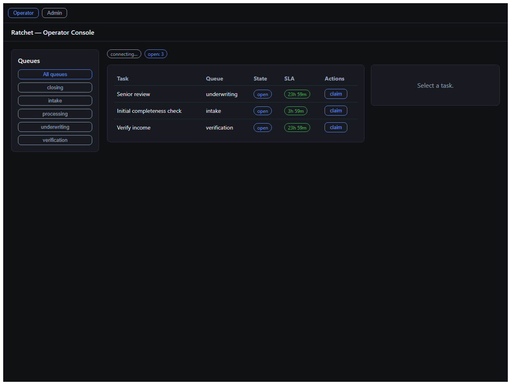

# Local demo (Docker)

Bring the whole stack up — Postgres, Redis, API, worker, and the web console — in one command.



## Prerequisites

- Docker Desktop running.

## 1. Start everything

```bash
docker compose up --build -d
```

First run builds the app image (a few minutes). The one-shot `migrate` and `seed` services run
automatically: the schema is applied and the loan-pipeline demo (5 queues, 4 agents, 12 rules) is
seeded into tenant **Demo**. `api`, `worker`, and `web` start once migrations finish.

## 2. Open the console

1. Issue an admin key for the Demo tenant:
   ```bash
   docker compose run --rm api pnpm --filter @workspace/api issue-key -- --tenant Demo --role admin
   ```
2. Open **http://localhost:5173** and paste the printed key.

## 3. Make tasks appear

Post an event; the worker turns it into tasks that show up **live** in the console (no reload):

```bash
curl -X POST http://localhost:3000/events \
  -H 'Content-Type: application/json' -H "Authorization: Bearer <KEY>" \
  -d '{"idempotencyKey":"demo-1","type":"application.submitted","entityId":"LA-1001","payload":{"amount":750000}}'
```

An amount over `500000` triggers **R1** (intake) and **R2** (underwriting). A `document.uploaded` with
`type: paystub` triggers **R3** (verification). All 12 rules are in [demo-domain.md](demo-domain.md).

## Ports

| Service | URL |
|---|---|
| Console | http://localhost:5173 |
| API | http://localhost:3000 (`/events`, `/graphql`, `/metrics`) |
| Postgres | localhost:5433 · Redis: localhost:6379 |

## Stop

```bash
docker compose down       # stop, keep data
docker compose down -v     # also wipe Postgres/Redis volumes
```

> This is a local development/demo stack. For a public URL (reviewers) and trustworthy load-test
> numbers, deploy to the Oracle server per docs/scope.md.
